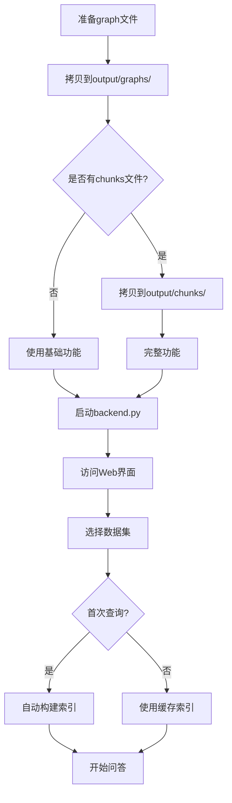

# 自定义Graph支持功能总结

## 📋 概述

为了支持用户手动拷贝已构建好的graph.json文件并在Web界面中使用，进行了以下修改和新增功能。

---

## 🔧 修改内容

### 1. 修改 `backend.py`

**文件**: `backend.py`  
**位置**: `/api/datasets` 接口  
**修改点**: 行 832-865

**功能**：扫描 `output/graphs/` 目录，自动识别所有 `*_new.json` 文件作为可用数据集

**关键代码**:
```python
# Scan output/graphs directory for manually copied graph files
graphs_dir = "output/graphs"
if os.path.exists(graphs_dir):
    for filename in os.listdir(graphs_dir):
        if filename.endswith("_new.json"):
            dataset_name = filename[:-9]  # Remove "_new.json"
            if dataset_name not in dataset_names:
                datasets.append({
                    "name": dataset_name,
                    "type": "custom",  # 新增类型标识
                    "status": "ready"
                })
```

**效果**：
- ✅ 自动发现手动添加的graph文件
- ✅ 在Web界面下拉框中显示
- ✅ 标记为 `custom` 类型以区分其他数据集

---

## 📄 新增文档

### 1. 详细使用指南

**文件**: `如何添加自定义graph文件.md`

**内容**:
- 📚 完整的使用说明
- 🔍 索引构建机制详解
- 📊 三种配置方案对比
- ❓ 常见问题解答
- 🛠️ 技术细节说明

**章节**:
1. 修改内容说明
2. 关于检索索引的重要说明
3. 使用方法（方案A/B/C）
4. 文件命名规则
5. Web界面使用
6. 数据集类型标识
7. 完整示例
8. 常见问题
9. 技术细节

### 2. 快速上手指南

**文件**: `CUSTOM_GRAPH_QUICK_START.md`

**内容**:
- 🚀 3步快速开始
- ✅ 索引自动构建说明
- 📊 功能对比表
- 📁 文件配置方案
- 🎯 实战示例
- ❓ 常见问题

**特点**:
- 简洁明了
- 快速上手
- 实用性强

---

## 🛠️ 新增工具

### 数据集检查工具

**文件**: `check_dataset.py`

**功能**:
1. **列出所有数据集**
   ```bash
   python3 check_dataset.py --list
   ```

2. **检查特定数据集配置**
   ```bash
   python3 check_dataset.py <数据集名称>
   ```

**输出信息**:
- ✅ 文件存在性检查（graph, chunks, corpus, cache）
- 📊 文件大小和内容统计
- 🔧 功能支持情况
- 📁 数据集类型判断
- 💡 配置建议

**示例输出**:
```
============================================================
检查数据集: my_dataset
============================================================

📊 文件检查结果:
------------------------------------------------------------
✅ Graph 文件: output/graphs/my_dataset_new.json
   大小: 0.11 MB
   节点数: 未知（关系列表格式）
   边数: 239

⚠️  Chunks 文件: 不存在（可选）
   预期路径: output/chunks/my_dataset.txt
   影响: 无法检索原始文档片段

🔧 功能支持情况:
------------------------------------------------------------
✅ 支持 - 图谱可视化
✅ 支持 - 基础问答
❌ 不支持 - 完整问答（含原文片段）

💡 建议:
------------------------------------------------------------
⚠️  建议添加chunks文件以获得更好的问答体验
```

---

## 📊 功能支持矩阵

| 文件配置 | 可视化 | 基础问答 | 完整问答 | 重建图谱 | 删除 |
|---------|-------|---------|---------|---------|------|
| 仅Graph | ✅ | ✅ | ❌ | ❌ | ✅ |
| Graph+Chunks | ✅ | ✅ | ✅ | ❌ | ✅ |
| Graph+Chunks+Corpus | ✅ | ✅ | ✅ | ✅ | ✅ |

---

## 🔍 索引构建机制

### 自动构建时机

系统在以下情况会**自动构建**FAISS索引：

1. ✅ 第一次调用 `kt_retriever.build_indices()` 时
2. ✅ 检测到graph文件变化时
3. ✅ 检测到模型维度变化时
4. ✅ 缓存文件不一致或损坏时

### 索引内容

基于graph文件构建：
- ✅ 节点索引（Node Index）
- ✅ 关系索引（Relation Index）
- ✅ 三元组索引（Triple Index）
- ✅ 社区索引（Community Index）

### 缓存位置

```
retriever/faiss_cache_new/{数据集名称}/
├── node.index              # 节点FAISS索引
├── relation.index          # 关系FAISS索引
├── triple.index            # 三元组FAISS索引
├── comm.index              # 社区FAISS索引
├── node_embeddings.pt      # 节点向量
├── relation_embeddings.pt  # 关系向量
└── node_map.json           # 节点映射
```

### 关键发现

**✅ 无需手动构建索引！**

- 索引会在第一次问答时自动构建
- 构建时间：10秒-3分钟（取决于图大小）
- 后续查询使用缓存，速度很快

**⚠️ Chunks文件的影响**

- 有Chunks：完整功能，可检索原始文档片段
- 无Chunks：基础功能，仅基于图结构检索

---

## 🎯 使用流程

### 完整流程



### 快速流程（3步）

1. **拷贝文件**
   ```bash
   cp my_graph.json output/graphs/my_dataset_new.json
   ```

2. **启动服务**
   ```bash
   python3 backend.py
   ```

3. **使用Web界面**
   - 访问 `http://localhost:8000`
   - 选择数据集 `my_dataset`
   - 开始使用

---

## 📁 目录结构

### 添加自定义graph后的目录结构

```
workspace/
├── backend.py                           # ✨ 已修改
├── check_dataset.py                     # ✨ 新增工具
├── 如何添加自定义graph文件.md            # ✨ 新增文档
├── CUSTOM_GRAPH_QUICK_START.md         # ✨ 新增文档
├── CUSTOM_GRAPH_SUMMARY.md             # ✨ 新增文档
│
├── output/
│   ├── graphs/
│   │   ├── demo_new.json               # 示例数据集
│   │   ├── my_custom_graph_new.json    # ✨ 自定义graph
│   │   └── your_graph_new.json         # ✨ 你的graph
│   │
│   └── chunks/
│       ├── demo.txt                    # 示例chunks
│       ├── my_custom_graph.txt         # ✨ 可选chunks
│       └── your_graph.txt              # ✨ 可选chunks
│
├── data/
│   └── uploaded/
│       └── {dataset}/
│           └── corpus.json             # ✨ 可选corpus
│
└── retriever/
    └── faiss_cache_new/
        ├── demo/                       # demo索引缓存
        ├── my_custom_graph/            # ✨ 自动生成
        └── your_graph/                 # ✨ 自动生成
```

---

## 🎨 数据集类型

系统现在支持三种数据集类型：

### 1. Demo 数据集
- **标识**: `type: "demo"`
- **来源**: 系统自带示例
- **特点**: 不可删除
- **用途**: 学习和测试

### 2. Uploaded 数据集
- **标识**: `type: "uploaded"`
- **来源**: Web界面上传
- **特点**: 完整功能，可删除
- **用途**: 生产使用

### 3. Custom 数据集 ✨
- **标识**: `type: "custom"`
- **来源**: 手动拷贝graph文件
- **特点**: 功能依赖于文件配置
- **用途**: 快速集成已有graph

---

## 🔄 工作流程对比

### 之前的流程

```
准备语料 → Web上传 → 系统构建graph → 使用
```

### 现在的流程

```
方式1（Web上传）:
准备语料 → Web上传 → 系统构建graph → 使用

方式2（手动添加）: ✨
准备graph → 拷贝文件 → 直接使用
```

**优势**：
- ✅ 支持外部构建的graph
- ✅ 无需重复构建
- ✅ 快速集成
- ✅ 灵活性高

---

## 🧪 测试验证

### 创建测试数据集

```bash
# 复制demo作为测试
cp output/graphs/demo_new.json output/graphs/test_new.json
cp output/chunks/demo.txt output/chunks/test.txt

# 检查配置
python3 check_dataset.py test
```

### 验证Web界面

1. 启动服务：`python3 backend.py`
2. 访问：`http://localhost:8000`
3. 查看数据集列表
4. 选择 `test` 数据集
5. 进行可视化和问答测试

### 验证索引构建

```bash
# 删除test数据集的缓存
rm -rf retriever/faiss_cache_new/test

# 在Web界面提问
# 观察终端日志，应该显示"Building FAISS indices..."

# 检查索引文件
ls -lh retriever/faiss_cache_new/test/
```

---

## 📌 重要提示

### ✅ 优势

1. **灵活性**: 支持外部构建的graph
2. **简便性**: 无需重新构建，直接使用
3. **自动化**: 索引自动构建和缓存
4. **兼容性**: 不影响现有功能

### ⚠️ 注意事项

1. **文件命名**: 必须遵循 `{名称}_new.json` 格式
2. **文件格式**: 必须是GraphRAG标准格式
3. **Chunks可选**: 但影响问答完整性
4. **首次延迟**: 首次查询需要构建索引

### 🎯 最佳实践

1. **推荐配置**: Graph + Chunks
2. **命名规范**: 使用有意义的名称
3. **定期检查**: 使用 `check_dataset.py`
4. **文件备份**: 保留原始文件

---

## 📚 文档索引

- **快速开始**: [CUSTOM_GRAPH_QUICK_START.md](./CUSTOM_GRAPH_QUICK_START.md)
- **详细说明**: [如何添加自定义graph文件.md](./如何添加自定义graph文件.md)
- **主文档**: [README-CN.md](./README-CN.md)

---

## 🎉 总结

通过本次功能更新：

1. ✅ 支持手动添加已构建的graph文件
2. ✅ 自动识别和管理自定义数据集
3. ✅ 自动构建和缓存检索索引
4. ✅ 提供完善的检查和诊断工具
5. ✅ 保持向后兼容，不影响现有功能

**用户现在可以**:
- 🚀 快速集成外部构建的知识图谱
- 🔍 便捷管理多个数据集
- ⚡ 享受自动化的索引构建
- 🛠️ 使用工具进行配置检查

---

**更新日期**: 2025-10-21  
**版本**: v1.0
