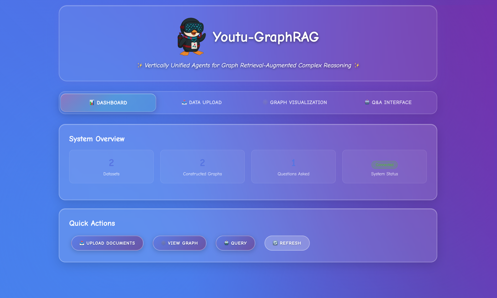
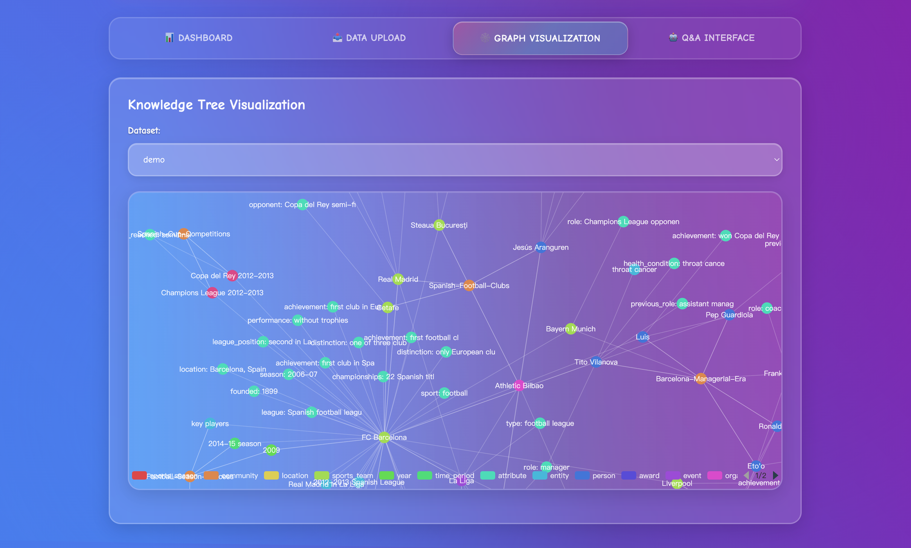
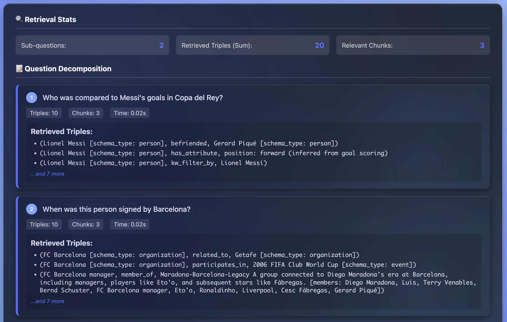

<div align="center">


# 🌟 Youtu-GraphRAG: Vertically Unified Agents for Graph Retrieval-Augmented Complex Reasoning

[](https://opensource.org/licenses/MIT)
[](Youtu-GraphRAG.pdf)
[](assets/wechat.png)

*🚀 Revolutionary framework moving Pareto Frontier with 90.71% lower token cost and 16.62% higher accuracy over SOTA baselines*

[🔖 中文版](README-CN.md) • [⭐ Contributions](#contributions) • [📊 Benchmarks](https://huggingface.co/datasets/Youtu-Graph/AnonyRAG) • [🚀 Getting Started](#quickstart)


</div>

## 🏗️ Framework Architecture

<div align="center">
<br>
A skeched overview of our proposed framework Youtu-GraphRAG.
</div>

## 📲 Interactive interface

<div align="center">



</div>

## 🎯 Brief Introduction

<table>
<tr>
<td width="30%">

</td>
<td width="70%">

**Youtu-GraphRAG** is a vertically unified agentic paradigm that jointly connects the entire framework as an intricate integration based on graph schema. We allow seamless domain transfer with minimal intervention on the graph schema, providing insights of the next evolutionary GraphRAG paradigm for real-world applications with remarkable adaptability.

📊 **Results**: Extensive experiments across six challenging benchmarks demonstrate the robustness of Youtu-GraphRAG, remarkably moving the Pareto frontier with up to **90.71% saving of token costs** and **16.62% higher accuracy** over state-of-the-art baselines. The results indicate our adaptability, allowing seamless domain transfer with minimal intervention on schema.

</td>
</tr>
</table>

<div align="center">


</div>

### 🎨 When to use Youtu-GraphRAG: Main Application Scenarios

🔗 Multi-hop Reasoning/Summarization/Conclusion: Complex questions requiring multi-step reasoning<br>
📚 Knowledge-Intensive Tasks: Questions dependent on large amounts of structured/private/domain knowledge<br>
🌐 Domain Scalability: Easily support novels, encyclopedias, academic papers, personal knowledge base, private/commercial knowledge base and other domains with minimal intervention on the schema<br>

<a id="contributions"></a>
## 🚀 Contributions and Novelty

Based on our unified agentic paradigm for Graph Retrieval-Augmented Generation (GraphRAG), Youtu-GraphRAG introduces several key innovations that jointly connect the entire framework as an intricate integration:


<summary><strong>🏗️ 1. Schema-Guided Hierarchical Knowledge Tree Construction</strong></summary>

- 🌱 **Seed Graph Schema**: Introduces targeted entity types, relations, and attribute types to bound automatic extraction agents
- 📈 **Scalable Schema Expansion**: Continuously expands schemas for adaptability over unseen domains
- 🏢 **Four-Level Architecture**: 
  - **Level 1 (Attributes)**: Entity property information
  - **Level 2 (Relations)**: Entity relationship triples
  - **Level 3 (Keywords)**: Keyword indexing
  - **Level 4 (Communities)**: Hierarchical community structure
- ⚡ **Quick Adaptation to industrial applications**: We allow seamless domain transfer with minimal intervention on the schema


<summary><strong>🌳 2. Dually-Perceived Community Detection</strong></summary>

- 🔬 **Novel Community Detection Algorithm**: Fuses structural topology with subgraph semantics for comprehensive knowledge organization
- 📊 **Hierarchical Knowledge Tree**: Naturally yields a structure supporting both top-down filtering and bottom-up reasoning that performs better than traditional Leiden and Louvain algorithms
- 📝 **Community Summaries**: LLM-enhanced community summarization for higher-level knowledge abstraction


<summary><strong>🤖 3. Agentic Retrieval</strong></summary>

- 🎯 **Schema-Aware Decomposition**: Interprets the same graph schema to transform complex queries into tractable and parallel sub-queries
- 🔄 **Iterative Reflection**: Performs reflection for more advanced reasoning through IRCoT (Iterative Retrieval Chain of Thought)


<!-- <details> -->
<summary><strong>🧠 4. Advanced Construction and Reasoning Capabilities for real-world deployment</strong></summary>

- 🎯 **Performance Enhancement**: Less token costs and higher accuracy with optimized prompting, indexing and retrieval strategies
- 🤹‍♀️ **User friendly visualization**: In ```output/graphs/```, the four-level knowledge tree supports visualization with neo4j import，making reasoning paths and knowledge organization vividly visable to users
- ⚡ **Parallel Sub-question Processing**: Concurrent handling of decomposed questions for efficiency and complex scenarios
- 🤔 **Iterative Reasoning**: Step-by-step answer construction with reasoning traces
- 📊 **Domain Scalability**: Designed for enterprise-scale deployment with minimal manual intervention for new domains
<!-- </details> -->


<summary><strong>📈 5. Fair Anonymous Dataset 'AnonyRAG'</strong></summary>
<details>
- Link: [Hugging Face AnonyRAG](https://huggingface.co/datasets/Youtu-Graph/AnonyRAG)
- **Against knowledeg leakage in LLM/embedding model pretraining**
- **In-depth test on real retrieval performance of GraphRAG**
- **Multi-lingual with Chinese and English versions**
</details>


<summary><strong>⚙️ 6. Unified Configuration Management</strong></summary>

- 🎛️ **Centralized Parameter Management**: All components configured through a single YAML file
- 🔧 **Runtime Parameter Override**: Dynamic configuration adjustment during execution
- 🌍 **Multi-Environment Support**: Seamless domain transfer with minimal intervention on schema
- 🔄 **Backward Compatibility**: Ensures existing code continues to function


## 📁 Project Structure

```
youtu-graphrag/
├── 📁 config/                     # Configuration System
│   ├── base_config.yaml           # Main configuration file
│   ├── config_loader.py           # Configuration loader
│   └── __init__.py                # Configuration module interface
│
├── 📁 data/                       # Data Directory
│
├── 📁 models/                     # Core Models
│   ├── 📁 constructor/            # Knowledge Graph Construction
│   │   └── kt_gen.py              # KTBuilder - Hierarchical graph builder
│   ├── 📁 retriever/              # Retrieval Module
│   │   ├── enhanced_kt_retriever.py  # KTRetriever - Main retriever
│   │   ├── agentic_decomposer.py     # Query decomposer
│   └── └── faiss_filter.py           # DualFAISSRetriever - FAISS retrieval
│
├── 📁 utils/                      # Utility Modules
│   ├── tree_comm.py              # community detection algorithm
│   ├── call_llm_api.py           # LLM API calling
│   ├── eval.py                   # Evaluation tools
│   └── graph_processor.py        # Graph processing tools
│
├── 📁 schemas/                   # Dataset Schemas
├── 📁 assets/                    # Assets (images, figures)
│
├── 📁 output/                    # Output Directory
│   ├── graphs/                   # Constructed knowledge graphs
│   ├── chunks/                   # Text chunk information
│   └── logs/                     # Runtime logs
│
├── 📁 retriever/                 # Retrieval Cache
│
├── main.py                       # 🎯 Main program entry
├── requirements.txt              # Dependencies list
└── README.md                     # Project documentation
```

### 🔧 Key Configuration Points

| Configuration Category | Key Parameters | Description |
|------------------------|----------------|-------------|
| **🤖 Mode** | `triggers.mode` | agent(intelligent)/noagent(basic) |
| **🏗️ Construction** | `construction.max_workers` | Graph construction concurrency |
| **🔍 Retrieval** | `retrieval.top_k_filter`, `recall_paths` | Retrieval parameters |
| **🧠 Agentic CoT** | `retrieval.agent.max_steps` | Iterative retrieval steps |
| **🌳 Community Detection** | `tree_comm.struct_weight` | Weight to control impacts from topology |
| **⚡ Performance** | `embeddings.batch_size` | Batch processing size |

<a id="quickstart"></a>

## 🚀 Quick Start
We provide two approaches to run and experience the demo service.

### 💻 Web UI Experience
```bash
# 1. Clone Youtu-GraphRAG project
git clone https://github.com/TencentCloudADP/Youtu-GraphRAG

# 2. Create .env according to .env.example
cd Youtu-GraphRAG && touch .env
# LLM_MODEL=deepseek-chat
# LLM_BASE_URL=https://api.deepseek.com
# LLM_API_KEY=sk-xxxxxx

# 3. Setup environment
./setup_env.sh

# 4. Launch the web
./start.sh

# 5. Visit http://localhost:8000
curl -v http://localhost:8000
```

### 💻 Start with dockerfile
```bash
# 1. Clone Youtu-GraphRAG project
git clone https://github.com/TencentCloudADP/Youtu-GraphRAG

# 2. Create .env according to .env.example
cd Youtu-GraphRAG && touch .env
# LLM_MODEL=deepseek-chat
# LLM_BASE_URL=https://api.deepseek.com
# LLM_API_KEY=sk-xxxxxx

# 3. Build with dockerfile 
docker build -t youtu_graphrag:v1 .

# 4. Docker run
docker run -d -p 8000:8000 youtu_graphrag:v1

# 5. Visit http://127.0.0.1:8000
curl -v http://127.0.0.1:8000
```


### 📖 Full Usage Guide
For advanced config and usage：[**🚀 FullGuide**](FULLGUIDE.md)

## ⭐ **Start using Youtu-GraphRAG now and experience the intelligent question answering!** 🚀

## 🤝 Contributing

We welcome contributions from the community! Here's how you can help:

### 💻 Code Contribution
1. 🍴 Fork the project
2. 🌿 Create a feature branch (`git checkout -b feature/AmazingFeature`)
3. 💾 Commit your changes (`git commit -m 'Add some AmazingFeature'`)
4. 📤 Push to the branch (`git push origin feature/AmazingFeature`)
5. 🔄 Create a Pull Request

### 🔧 Extension Guide
- **🌱 New Seed Schemas**: Add high-quality seed schema and data processing
- **📊 Custom Datasets**: Integrate new datasets with minimal schema intervention
- **🎯 Domain-Specific Applications**: Extend framework for specialized use cases with 'Best Practice'


## 📄 License

This project is licensed under the [MIT License](LICENSE) - see the LICENSE file for details.

## 📞 Contact

**Hanson Dong** - hansonjdong@tencent.com  **Siyu An** - siyuan@tencent.com

---

## 🎉 Citation

```bibtex
@misc{dong2025youtugraphrag,
      title={Youtu-GraphRAG: Vertically Unified Agents for Graph Retrieval-Augmented Complex Reasoning}, 
      author={Junnan Dong and Siyu An and Yifei Yu and Qian-Wen Zhang and Linhao Luo and Xiao Huang and Yunsheng Wu and Di Yin and Xing Sun},
      year={2025},
      eprint={2508.19855},
      archivePrefix={arXiv},
      url={https://arxiv.org/abs/2508.19855}, 
}
```

<!-- [](https://github.com/youtu-graphrag/youtu-graphrag) -->
