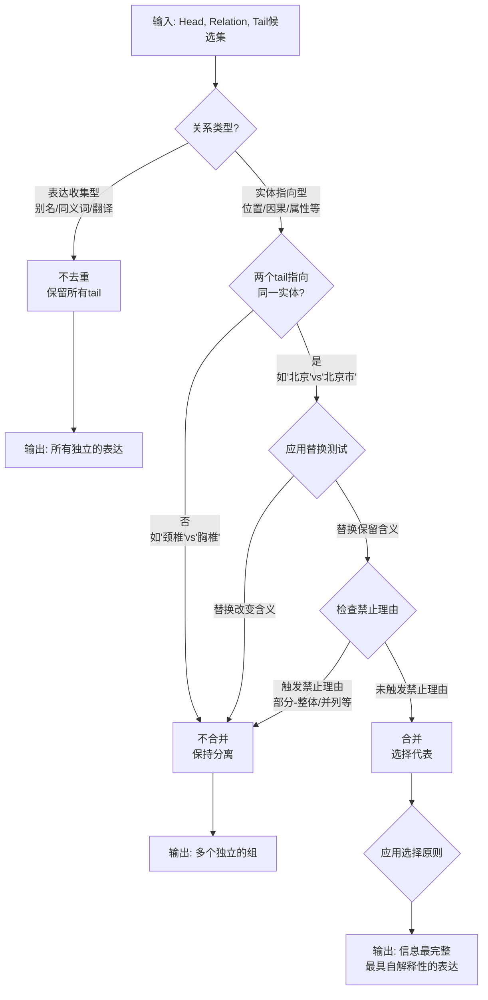

# LLM去重Prompt完整设计文档

## 核心洞察：去重必须依赖关系类型

### 关键问题

**用户的重要发现：**
> "如果关系是别名类似的，那么重复的tail不应该被合并吧？"

这揭示了一个根本性的问题：**去重行为不能一刀切，必须根据关系的语义来决定！**

---

## 关系类型分类（通用原则）

### 类型1：表达收集型关系（DO NOT DEDUPLICATE）

**定义特征：**
- 关系的**目的**是收集同一实体的**多种不同表达形式**
- 每个tail代表一个**不同的表达/名称**，而非独立实体
- tail的多样性本身就是有价值的信息

**语义类别：**
```
a) 别名/异名关系
   关系名示例：'别名', 'has_alias', 'also_known_as', 'alternative_name', '异名'
   
b) 同义词关系  
   关系名示例：'同义词', 'synonym', 'equivalent_term', '等价术语'
   
c) 翻译关系
   关系名示例：'翻译', 'translation', 'in_language', '其他语言表达'
   
d) 表达变体关系
   关系名示例：'variant', 'form_of', '变体'
```

**实例说明：**
```
(MRI, 别名, "MRI")
(MRI, 别名, "磁共振成像")
(MRI, 别名, "核磁共振")
(MRI, 别名, "magnetic resonance imaging")

→ 不应该合并！
→ 这4个tail都应该保留，因为关系的目的就是记录所有别名
```

**判断原则（通用）：**
> 如果关系R的语义是"X有多个名称/表达/同义词"，则不去重

---

### 类型2：实体指向型关系（DO DEDUPLICATE）

**定义特征：**
- 关系指向**实际存在的实体/概念**
- tail代表现实世界中的对象，而非表达形式
- 相同实体的不同表达应该合并

**语义类别：**
```
a) 位置关系
   关系名示例：'位于', 'located_in', 'part_of', '属于'
   
b) 因果关系
   关系名示例：'导致', 'causes', '引起', '治疗', 'treats'
   
c) 属性关系
   关系名示例：'has_property', '具有特性', '属性值'
   
d) 时间关系
   关系名示例：'发生在', 'occurs_in', 'during'
   
e) 事实关系（绝大多数）
   关系名示例：任何描述实体间事实联系的关系
```

**实例说明：**
```
(医院A, 位于, "北京市")
(医院A, 位于, "北京")

→ 应该合并为"北京市"
→ 因为"北京市"和"北京"指向同一个地点实体
```

**判断原则（通用）：**
> 如果关系R的语义是"X与实体Y存在某种事实联系"，则应去重

---

## 通用判断流程

```
给定关系R：

1. 问：R的目的是收集表达多样性还是建立事实联系？
   ├─ 收集表达多样性 → 不去重（保留所有不同表达）
   └─ 建立事实联系 → 进入步骤2

2. 问：多个tail是否指向同一实体？
   ├─ 是（如"北京"和"北京市"） → 去重
   └─ 否（如"颈椎"和"胸椎"） → 不去重

3. 如果去重，选择信息最完整、最具自解释性的表达作为代表
```

---

## 完整案例分析

### 案例1：别名关系（不去重）✅

**输入：**
```json
{
  "head": "MRI扫描",
  "relation": "别名",
  "candidates": [
    {"index": 0, "description": "MRI"},
    {"index": 1, "description": "磁共振成像"},
    {"index": 2, "description": "核磁共振"},
    {"index": 3, "description": "magnetic resonance imaging"}
  ]
}
```

**正确输出：**
```json
{
  "groups": [
    {"members": [0], "representative": 0, "rationale": "保留'MRI'作为独立别名"},
    {"members": [1], "representative": 1, "rationale": "保留'磁共振成像'作为独立别名"},
    {"members": [2], "representative": 2, "rationale": "保留'核磁共振'作为独立别名"},
    {"members": [3], "representative": 3, "rationale": "保留'magnetic resonance imaging'作为独立别名"}
  ],
  "explanation": "关系'别名'的目的是收集所有不同的名称表达，因此不应该去重。每个别名都有其使用场景和价值。"
}
```

---

### 案例2：位置关系（应去重）✅

**输入：**
```json
{
  "head": "协和医院",
  "relation": "位于",
  "candidates": [
    {"index": 0, "description": "北京"},
    {"index": 1, "description": "北京市"},
    {"index": 2, "description": "Beijing"}
  ]
}
```

**正确输出：**
```json
{
  "groups": [
    {
      "members": [0, 1, 2],
      "representative": 1,
      "rationale": "'北京'、'北京市'、'Beijing'指向同一地点。选择'北京市'作为代表，因为它是完整的官方行政名称，信息量最大。"
    }
  ]
}
```

---

### 案例3：部分-整体关系（不去重）✅

**输入：**
```json
{
  "head": "流动伪影",
  "relation": "常见于",
  "candidates": [
    {"index": 0, "description": "颈椎"},
    {"index": 1, "description": "胸椎"},
    {"index": 2, "description": "腰椎"}
  ]
}
```

**正确输出：**
```json
{
  "groups": [
    {"members": [0], "representative": 0, "rationale": "颈椎 - 独立的解剖部位"},
    {"members": [1], "representative": 1, "rationale": "胸椎 - 独立的解剖部位"},
    {"members": [2], "representative": 2, "rationale": "腰椎 - 独立的解剖部位"}
  ],
  "explanation": "虽然颈椎、胸椎、腰椎都是脊柱的组成部分，且被并列列举，但它们是三个不同的解剖实体。部分-整体关系不是合并的理由。"
}
```

---

### 案例4：序列类型关系（应去重）✅

**输入：**
```json
{
  "head": "MRI检查",
  "relation": "使用序列",
  "candidates": [
    {"index": 0, "description": "SE序列"},
    {"index": 1, "description": "自旋回波序列"}
  ]
}
```

**正确输出：**
```json
{
  "groups": [
    {
      "members": [0, 1],
      "representative": 1,
      "rationale": "'SE序列'和'自旋回波序列'指向同一MRI脉冲序列。选择'自旋回波序列'作为代表，因为它是完整形式，具有更好的自解释性。"
    }
  ]
}
```

---

## 禁止的合并理由（完整列表）

### 1. 关系/结构类

```
✗ 共享关系："都满足与H的关系R" → 不足以构成共指
✗ 并列列举："X、Y、Z被一起列举" → 列举 ≠ 共指
✗ 部分-整体关系："X和Y是Z的组成部分" → 是同一整体的部分 ≠ 同一性
   • 示例：'颈椎'、'胸椎'、'腰椎'是脊柱的不同部分
✗ 集合表示："X、Y、Z共同构成/代表W" → 组成部分 ≠ 整体
✗ 功能关系："X导致/影响/包含Y" → 关系 ≠ 同一性
```

### 2. 相似性类

```
✗ 语义相似："X和Y相似/相关" → 相似性 ≠ 同一性
✗ 相同类别："都是类型T" → 类别成员资格 ≠ 实体同一性
```

### 3. 上下文类

```
✗ 共现："X和Y一起出现" → 上下文接近 ≠ 共指
✗ 频率："X出现更频繁" → 频率 ≠ 重要性
```

### 4. 集合论类

```
✗ 集合成员资格："X, Y ∈ 集合_S" → 在同一集合中 ≠ 是同一元素
✗ 共享属性："X和Y有属性P" → 属性共享 ≠ 实体同一性
```

---

## 代表性表达选择原则（当需要去重时）

### 通用选择原则

```
a) 信息完整性：优先选择传达更多信息的表达
   • 完整形式 > 缩写（'磁共振成像' > 'MRI'）
   • 完整名称 > 部分名称（'北京市' > '北京'）

b) 自解释性：优先选择无需领域知识即可理解的表达
   • 描述性术语 > 技术代码（'高血压' > 'I10'）
   • 通用名称 > 化学式（通用语境下，'水' > 'H₂O'）

c) 规范性：优先选择该领域的标准/官方形式
   • 官方名称 > 非正式名称
   • 现行名称 > 已废弃名称

d) 无歧义性：优先选择歧义较少的表达
   • 特定术语 > 通用术语

e) 受众适配：当原则冲突时，根据知识图谱的目标受众确定优先级
```

### 禁止的选择标准（通用类别）

```
✗ 形式特征（与含义无关的表面特征）：
  例如：长度、简洁性、紧凑性、字符数

✗ 位置特征（任意排序或位置）：
  例如：字母顺序、索引位置、文本中出现顺序

✗ 频率特征（统计出现模式）：
  例如：出现频率、哪个先被提及/提及更多

✗ 主观特征（个人或模型特定的偏好）：
  例如：熟悉度、处理难度、个人偏好
```

**核心原则：**
> 代表选择必须基于语义和信息标准，而不是基于任意、统计或形式特征。

---

## 替换测试（最可靠的判断方法）

### 测试步骤

```
给定两个候选tail (X, Y)：

1. 在原始语境中尝试替换：
   原句：包含X的句子
   替换：用Y替换X
   
2. 判断：
   - 含义是否完全保持？
   - 信息是否有损失？
   - 真值是否改变？
   
3. 结论：
   如果替换后含义/信息/真值都不变 → 可以合并
   否则 → 不应合并
```

### 示例应用

#### 应该合并的情况 ✅
```
原句："需要使用SE序列进行扫描"
替换："需要使用自旋回波序列进行扫描"
判断：含义完全相同，信息无损失
结论：应该合并 ✅
```

#### 不应该合并的情况 ❌
```
原句："颈椎、胸椎、腰椎都可能出现病变"
尝试："颈椎、颈椎、颈椎都可能出现病变"
判断：含义完全改变！原文说三个不同部位，替换后只说一个部位
结论：不应该合并 ❌
```

---

## 设计理念总结

### 三层设计架构

```
第1层：关系类型判断
├─ 表达收集型关系 → 不去重
└─ 实体指向型关系 → 进入第2层

第2层：实体同一性判断
├─ 应用替换测试
├─ 检查禁止合并理由
└─ 判断是否为同一实体 → 如果是，进入第3层

第3层：代表性表达选择
├─ 应用选择原则（信息完整性、自解释性等）
├─ 避免禁止的选择标准（简洁性、频率等）
└─ 输出最优代表
```

### 核心优势

✅ **关系感知** - 根据关系语义决定是否去重  
✅ **通用原则** - 基于语义类别而非具体列举  
✅ **双重约束** - 正面指导（应该做什么）+ 负面禁止（不应该做什么）  
✅ **可扩展性** - 新关系类型可自动归类  
✅ **鲁棒性** - 多层检查机制保证准确性  

---

## 完整决策树



---

## 预期效果矩阵

| 场景 | 关系类型 | 候选tail | 是否合并 | 选择代表 | 理由 |
|------|----------|----------|----------|----------|------|
| 别名收集 | 别名 | "MRI", "磁共振成像" | ❌ 不合并 | N/A | 关系目的是收集多样性 |
| 位置事实 | 位于 | "北京", "北京市" | ✅ 合并 | "北京市" | 同一地点，选择完整形式 |
| 解剖部位 | 常见于 | "颈椎", "胸椎", "腰椎" | ❌ 不合并 | N/A | 部分-整体关系，不同实体 |
| 检查序列 | 使用序列 | "SE序列", "自旋回波序列" | ✅ 合并 | "自旋回波序列" | 同一序列，选择完整形式 |
| 同义词收集 | 同义词 | "水", "H₂O" | ❌ 不合并 | N/A | 关系目的是收集同义表达 |

---

这是一个**通用的、关系感知的、鲁棒的**去重系统设计，能够处理各种复杂场景而不需要针对每个case单独调整。
